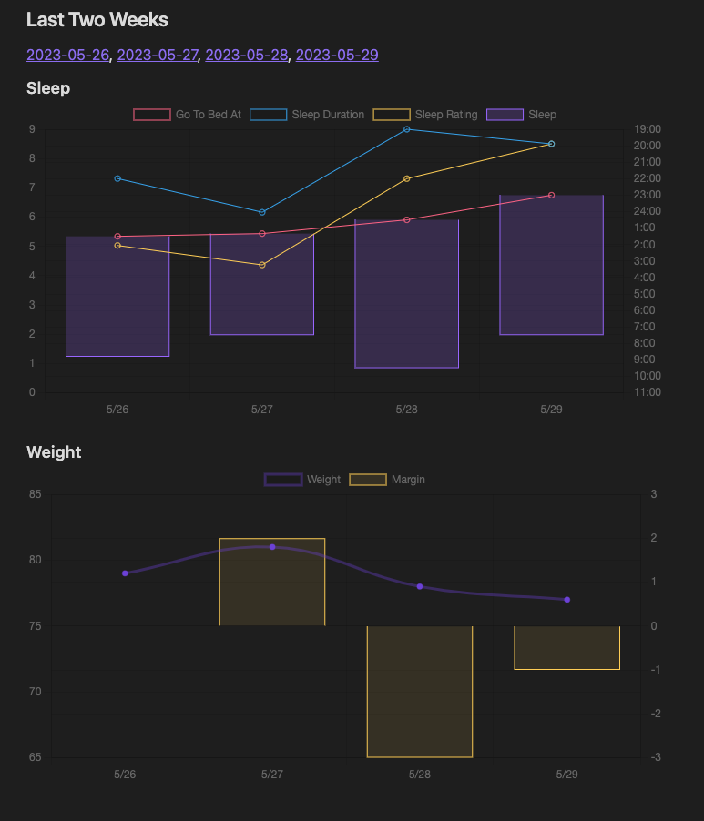

# An Example Vault
In this vault demonstrating:

1. Usage of Core Plug Daily and [periodic-notes](https://github.com/liamcain/obsidian-periodic-notes).
2. Written a [dataview](https://github.com/blacksmithgu/obsidian-dataview) js script and render a chart([obsidian-charts](https://github.com/phibr0/obsidian-charts)).
3. Written a [quickadd](https://github.com/chhoumann/quickadd) js script

### charts

### Quick Switch (Ctrl T)

